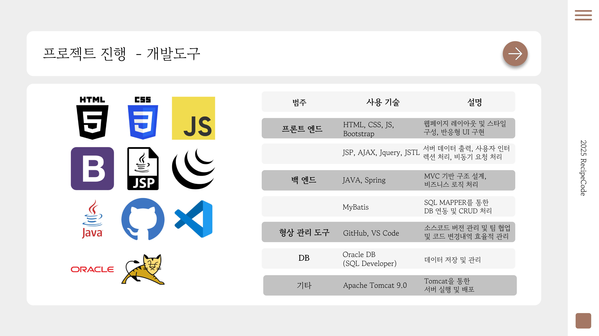
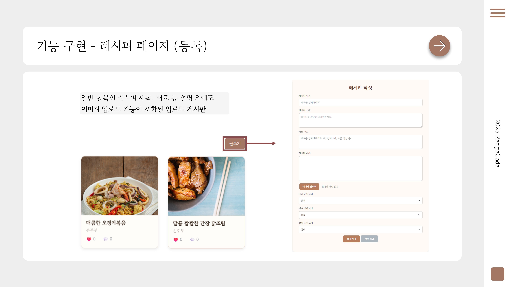
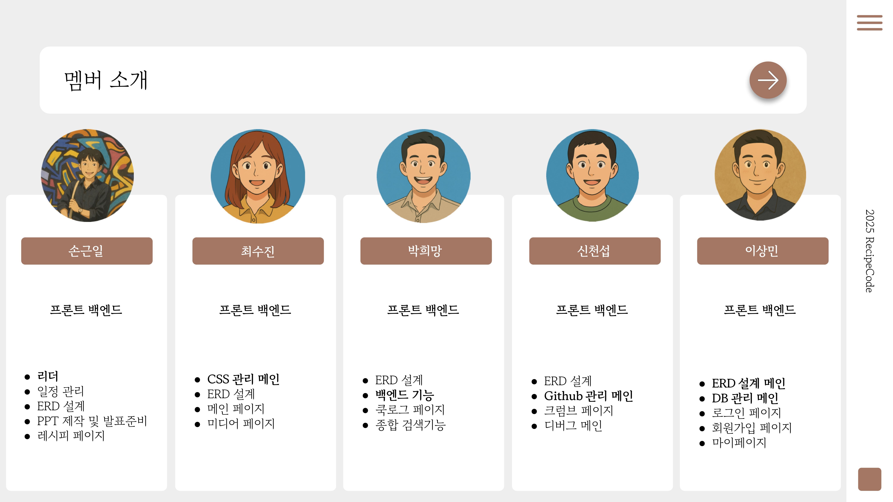
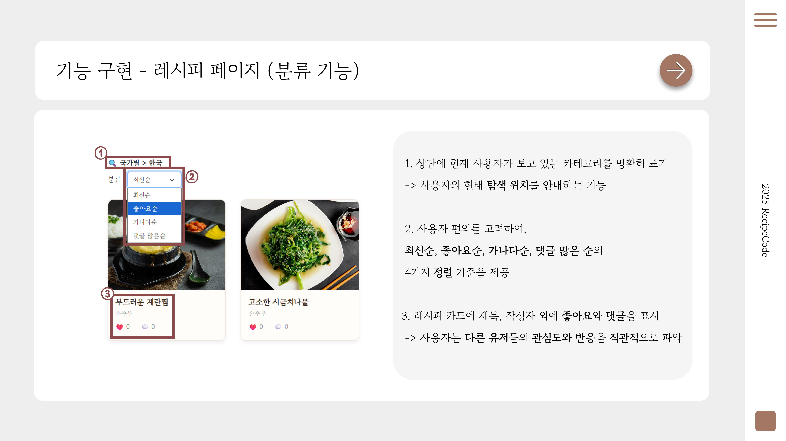
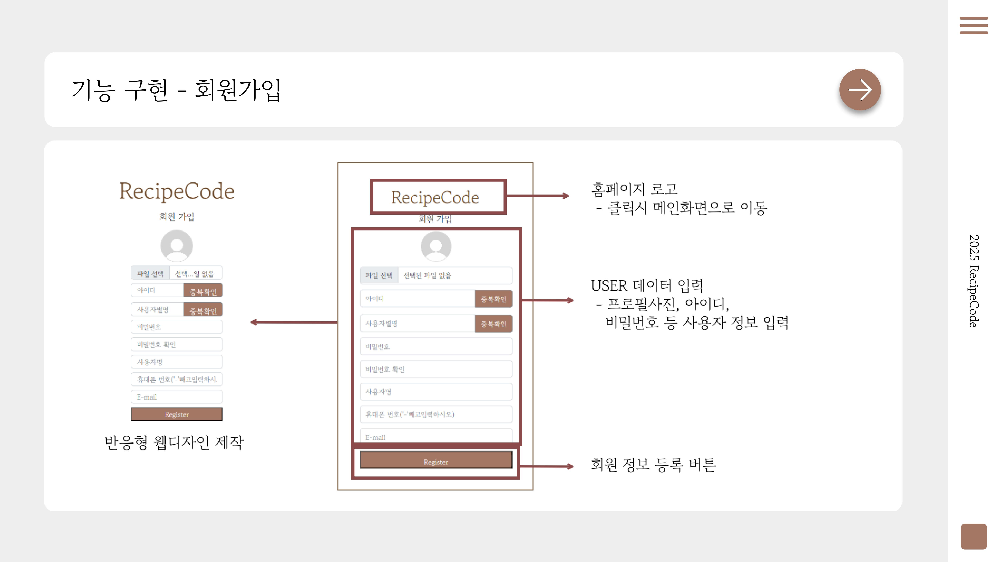
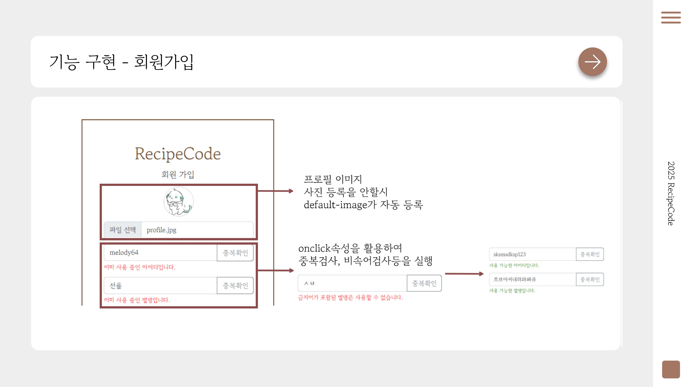

# 📌 RecipeCode 프로젝트
> 간단한 한 줄 소개  
> 예: "유저 커뮤니티 친화적인 레시피 사이트"

---

## 📜 목차
1. [프로젝트 소개](#프로젝트-소개)
2. [주요 기능](#주요-기능)
3. [기술 스택](#기술-스택)
4. [팀원 & 역할분담](#팀원--역할분담)


---

## 💡 프로젝트 소개
- 프로젝트 개요:
  - 흔한 정보 제공용 사이트가 아닌 유저들끼리의 소통이 중심인 레시피사이트
  - 요리레시피를 주제로 의견을 나누고 싶어하는 사람들을 위한 장소
- 개발 기간: 2025.07.02 ~ 2025.07.23 


---

## 🚀 주요 기능
- **회원 관리**: 회원가입, 로그인, 로그아웃
- **레시피 CRUD**: 레시피 작성, 수정, 삭제, 조회
- **카테고리 필터**: 한식, 양식, 미디어 등
- **검색 기능**: 레시피 제목/작성자/재료 검색
- **좋아요 & 댓글**: 사용자 반응 기능
- **반응형 UI**: 모바일·PC 환경 지원
---

## 🛠 기술 스택
| 분야 | 기술 |
|------|------|
| **Frontend** | HTML5, CSS3, JavaScript, JSP |
| **Backend** | Spring MVC, MyBatis, Java |
| **Database** | Oracle |
| **Tools** | Git, GitHub, IntelliJ IDEA, PPT |

---

## 📸 화면 예시 & 이미지

| 개발 도구 | 레시피 작성 페이지 |
|-------------|-------------------|
|  |  |

| 멤버 | 카테고리 페이지 |
|-------------------|----------------------|
|  |  |

| 로그인 페이지 | 회원가입 페이지 |
|---------------|-----------------|
|  |  |


## ⚙ 실행 방법
1. 레포지토리 클론  
   ```bash
   git clone https://github.com/mapadubumaenia/TeamProjet.git


